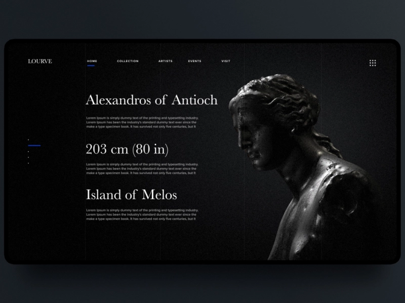

# Marcus Aurelius
[https://nduatik.github.io/marcus-aurelius/](https://nduatik.github.io/marcus-aurelius/)

Design by [Kevin Pham](https://dribbble.com/shots/14281766-Ancient-Art-Museum-Landing-Page)



## dependencies

This project requires the latest LTS version of [Node.js](https://nodejs.org/)

```bash
npm install -g elm elm-spa
```

## running locally

```bash
elm-spa server  # starts this app at http:/localhost:1234
```

Create a link to docs called public
```
mklink /J public docs 
```

### other commands

```bash
elm-spa add    # add a new page to the application
elm-spa build  # production build
elm-spa watch  # runs build as you code (without the server)
```

## learn more

You can learn more at [elm-spa.dev](https://elm-spa.dev)